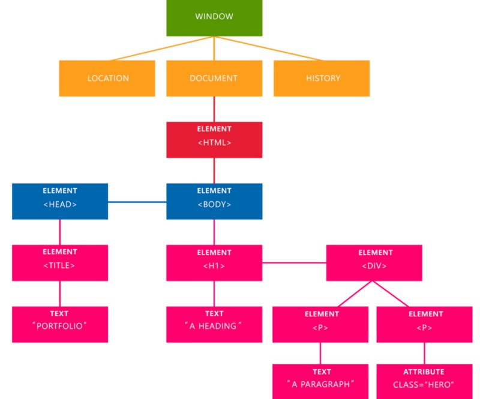

Tópicos da Aula:

# Adicionando javascript no HTML

Para referenciar o arquivo JS a ser utilizado pelo HTML usaremos a tag `<script>`. O atributo `src` deve informar o caminho do seu arquivo JS.

```HTML
<script src="index.js"></script>
```

#### Onde utilizar

```HTML
<!DOCTYPE html>
<html lang="en">
<head>
   <meta charset="UTF-8">
   <meta name="viewport" content="width=device-width, initial-scale=1.0">
   <meta http-equiv="X-UA-Compatible" content="ie=edge">
   <title>Exemple</title>
</head>
<body>
   <!-- Sempre colocar a tag <script> antes do fechamento da tag body e ao final das demais tags. -->
   <script src="./index.js"></script>
</body>
</html>
```

---

## DOM - Document Object Model

### O que é DOM ?

DOM é uma sigla que significa **Document Object Model.** Quando a página é carregada o browser cria um objeto que representa os elementos da página a partir do **HTML.** A forma mais fácil de acessar e manipular o DOM é usando JavaScript.



- **Document** - representa o documento HTML
- **Element** - são todas as tags que estão no arquivo HTML e se transformam em elementos da árvore DOM
- **Text** - é o conteúdo de texto que vai entre os elementos (tags).
- **Attribut** - são os todos atributos para um nó específico. No caso, o attribute class="HERO" está associado ao elemento, outros exemplos de atributos são o href, o id, entre outros.

---

## Manipulando o DOM

O DOM é a representação do objeto do documento HTML e atua como uma interface de programação que permite a manipulação de sua estrutura com o JavaScript ou outras linguagens.

Podemos manipular o DOM para realizar alterações na estrutura do HTML, alterar estilos e modificar conteúdos.


---

Métodos úteis do DOM para HTML

- getElementById
- querySelector

Métodos do DOM para manipular CSS
Adicionar e remover classes do HTML pelo Javascript

Eventos no Javascript
-Click
-Submit

Capturar valores de inputs em eventos

Validações com condicionais (if/else)
Regex https://regexr.com/

Objeto Date e seus métodos \*extra
